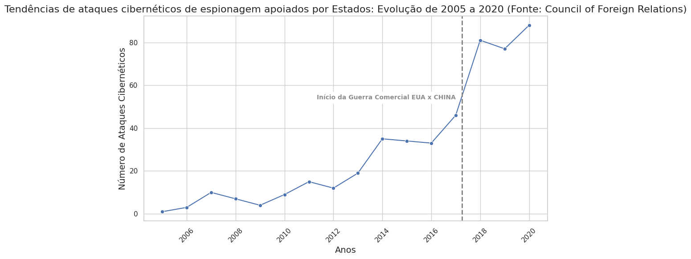

# Análise de Ataques Cibernéticos Apoiados por Estados (2005-2020)

Este repositório contém códigos e análises baseados no dataset "Cyber Operations Incidents Up to 2020", disponível no Kaggle. O projeto tem como objetivo explorar tendências e distribuições de ataques cibernéticos de espionagem apoiados por estados.

## Estrutura do Repositório

- **`dataset/cyber-operations-incidents.csv`**: Dataset de incidentes de cyber-operações apoiadas por Estados, proviniente do Kaggle e coletada do banco de dados do [Council of Foreign Nations](https://www.cfr.org/).
- **`analises/grafico_distribuicao.py`**: Código para gerar o gráfico de distribuição de ataques cibernéticos por país.
- **`analises/grafico_tendencia.py`**: Código para gerar o gráfico de tendência temporal dos ataques cibernéticos.
- **`ProjetoMensal.ipynb`**: Notebook exportado do Google Colab contendo a análise completa e integrada.
- **`requirements.txt`**: Lista de dependências necessárias para executar os scripts localmente.

## Metodologias de Execução

### 1. Executar via Google Colab

1. Acesse o projeto diretamente no Google Colab: **[Link para o Google Colab](https://colab.research.google.com/drive/1IEdpCqGzmj7m7EqyAlDQCyS8YLClOHfl?usp=sharing)**.
2. Envie os arquivos de código (é recomendável dividir os códigos em células separadas).
3. Certifique-se de importar o dataset a partir do Kaggle, utilizando a biblioteca `kagglehub` para download.
4. Execute as células sequencialmente.

### 2. Executar Localmente com Python

#### Passo 1: Clonar o Repositório

```bash
# Clonar este repositório
$ git clone https://github.com/jean-mb/analises-cyberattacks.git

# Navegar até o diretório do projeto
$ cd analises-cyberattacks
```

#### Passo 2: Criar e Ativar o Ambiente Virtual

```bash
# Criar um ambiente virtual
$ python -m venv .venv

# Ativar o ambiente virtual
# No Windows:
$ .venv\Scripts\activate
# No Linux/Mac:
$ source .venv/bin/activate
```

#### Passo 3: Instalar as Dependências

```bash
# Instalar pacotes necessários
$ pip install -r requirements.txt
```

#### Passo 4: Executar os Códigos

- Para gerar o gráfico de distribuição:

  ```bash
  $ python3 grafico_distribuicao.py
  ```

- Para gerar o gráfico de tendência:

  ```bash
  $ python3 grafico_tendencia.py
  ```

#### Passo 5: Visualizar os Resultados

Os gráficos gerados serão exibidos diretamente na tela.

> Tendências de ataques cibernéticos de espionagem apoiados por Estados: Evolução de 2005 a 2020



> Distribuição global de ataques cibernéticos apoiados por Estados: Principais países de 2005 a 2020


## Dataset

O dataset utilizado neste projeto está disponível no Kaggle:
**[Cyber Operations Incidents Up to 2020](https://www.kaggle.com/datasets/fireballbyedimyrnmom/cyber-incidents-up-to-2020)**.

O dataset é proveniente do **Council of Foreign Relations** e faz parte do programa *Digital and Cyberspace Policy*. Ele compila incidentes patrocinados por estados que ocorreram desde 2005 e que são publicamente conhecidos. Para mais informações, acesse: **[Council on Foreign Relations - Cyber Operations Tracker](https://www.cfr.org/cyber-operations)**.

## Dependências

- Python 3.7+
- pandas
- seaborn
- matplotlib
- kagglehub

Para mais informações ou contribuições, entre em contato através da aba de *Issues* neste repositório.

---

### Licença

Este projeto é licenciado sob a [MIT License](LICENSE).

